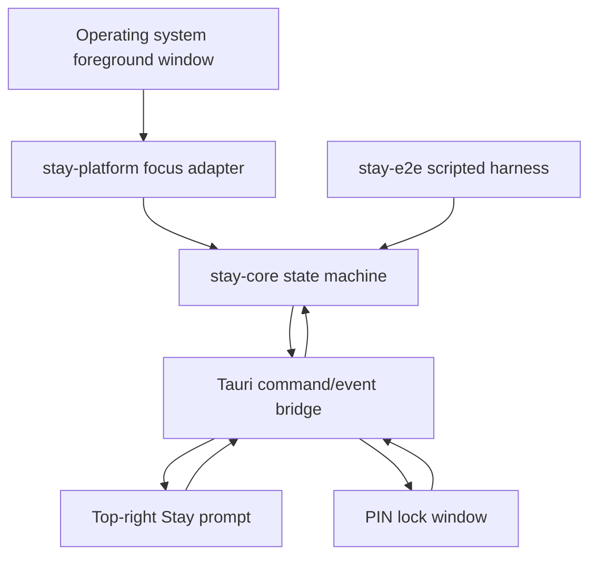
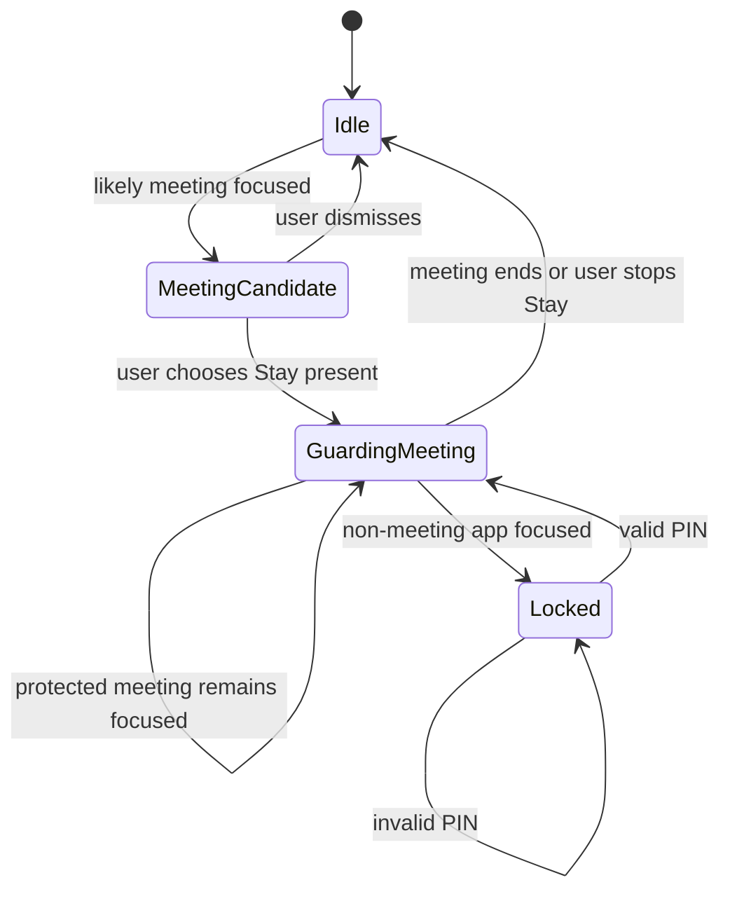

# feat: Add Meeting Focus Guard

## Summary

Build the first cross-platform Stay desktop slice as a Rust-first app that detects likely meeting windows, asks the user whether to Stay present, and requires a four-digit PIN when focus leaves the active meeting. The implementation should make autonomous verification a first-class path by separating the focus-policy engine from native OS adapters and UI rendering.

---

## Problem Frame

Stay exists to make focused meeting presence the easy default without becoming surveillance or management software. The first application slice needs to prove the core loop: detect a meeting, invite the user into Stay, and add a small voluntary friction step when attention leaves that meeting.

---

## Assumptions

*This plan was authored without synchronous user confirmation. The items below are agent inferences that fill gaps in the input -- un-validated bets that should be reviewed before implementation proceeds.*

- Tauri v2 is the right desktop shell for this initial product because it gives native windows, tray-ready packaging, and Rust-owned backend logic across macOS, Windows, and Linux while keeping the visible UI small.
- "Meeting detection similar to Granola" means passive local inference from the foreground window's application name and title, not calendar scraping, audio recording, transcription, or network inspection.
- The first version can enforce focus with an always-on-top Stay lock window and state machine friction, while deeper OS-level blocking or accessibility-driven refocus behavior remains a hardening item.
- The four-digit password is a user-set PIN for voluntary friction, not a high-security authentication factor.

---

## Requirements

- R1. Provide a macOS, Windows, and Linux compatible desktop application whose core behavior and business logic are implemented in Rust.
- R2. Detect likely active meeting windows from foreground app/window metadata without recording audio, reading meeting content, or sending local activity off-device.
- R3. When a likely meeting is detected, show a quiet top-right prompt asking whether the user wants to "Stay present" in the meeting.
- R4. After the user opts in, treat that meeting window as the protected meeting and require a valid four-digit PIN when focus switches to a non-meeting application.
- R5. Keep the implementation aligned with Stay's brand principles: opt-in, quiet by default, no productivity scoring, no manager controls, and no surveillance.
- R6. Provide automated unit, integration, and scripted end-to-end coverage that can run without a human operating the desktop UI.
- R7. Document platform permissions, development setup, and known limits clearly enough for autonomous follow-up agents to continue the work safely.

---

## Scope Boundaries

- No manager dashboards, team enforcement, analytics scores, attention metrics, or compliance reporting.
- No microphone recording, transcription, calendar scraping, screen recording, or remote telemetry.
- No claim that the initial lock is a security boundary; it is a voluntary friction layer.
- No app-store packaging or signed installers in this first slice.
- No deep per-platform accessibility automation beyond the minimum native focus observation needed for the first working loop.

### Deferred to Follow-Up Work

- Stronger OS-level enforcement: follow-up hardening after the topmost lock-window loop is verified.
- Calendar-aware meeting detection: future opt-in integration only if it can preserve the privacy model.
- Signed release packaging and auto-updates: separate release-engineering track once the product loop stabilizes.

---

## Context & Research

### Relevant Code and Patterns

- `BRAND.md` is the current source of truth for product posture, tone, and non-goals.
- The repository is otherwise greenfield: there are no existing source modules, test harnesses, or app conventions to preserve.

### Institutional Learnings

- No `docs/solutions/` entries exist yet.

### External References

- Tauri v2 desktop app model and window capabilities: https://v2.tauri.app/
- Tauri v2 window customization and always-on-top window options: https://v2.tauri.app/reference/config/#windowconfig
- Tauri v2 JavaScript/Rust command bridge: https://v2.tauri.app/develop/calling-rust/
- `active-win-pos-rs` foreground window metadata for Rust adapters: https://docs.rs/active-win-pos-rs/latest/active_win_pos_rs/
- Rust Cargo workspaces and integration testing conventions: https://doc.rust-lang.org/cargo/reference/workspaces.html

---

## Key Technical Decisions

- Rust workspace first: Put the durable domain logic in Rust crates (`stay-core`, `stay-platform`, and `stay-e2e`) so native adapters, UI shells, and automated tests all exercise the same policy engine.
- Tauri v2 desktop shell: Use a small local webview for presentation and Rust commands/events for state transitions, avoiding an Electron-sized app while retaining cross-platform window positioning.
- Passive local meeting detection: Classify meeting candidates from foreground window metadata with explicit allowlisted signatures for Zoom, Google Meet, Microsoft Teams, FaceTime, Webex, and browser meeting tabs.
- State machine over UI conditionals: Model meeting detection, opt-in, guarded focus, locked state, PIN attempts, and dismissals in `stay-core` before wiring native windows.
- Testable adapters: Hide OS focus polling behind traits so unit and E2E tests can run deterministic scripted focus changes without driving the host desktop.
- Privacy by construction: Keep all detection, PIN verification, and session state local; do not add telemetry infrastructure in this slice.

---

## Open Questions

### Resolved During Planning

- Which app shell should anchor the first implementation? Use Tauri v2 with Rust-owned logic because the product needs native window control, cross-platform packaging options, and a small UI surface.
- Should the first detector use invasive meeting sources? No. The first detector should use foreground window metadata only, matching the opt-in and privacy posture in `BRAND.md`.

### Deferred to Implementation

- Exact per-platform permission copy: final wording should be adjusted after the native adapter reveals which permissions each OS prompts for.
- Exact foreground-window crate behavior on Linux Wayland sessions: validate during implementation and document any unsupported desktop environments.
- Exact lock-window positioning around fullscreen spaces and virtual desktops: verify during app testing and record known limitations.

---

## Output Structure

    .
    ├── .github/
    │   └── workflows/
    │       └── ci.yml
    ├── apps/
    │   └── desktop/
    │       ├── dist/
    │       ├── package.json
    │       └── src-tauri/
    ├── crates/
    │   ├── stay-core/
    │   ├── stay-e2e/
    │   └── stay-platform/
    ├── docs/
    │   ├── development.md
    │   ├── platform-permissions.md
    │   └── plans/
    ├── Cargo.toml
    ├── Cargo.lock
    └── README.md

---

## High-Level Technical Design

> *This illustrates the intended approach and is directional guidance for review, not implementation specification. The implementing agent should treat it as context, not code to reproduce.*

State lifecycle:

---

## Implementation Units

### U1. Rust Workspace and Core State Machine

**Goal:** Create the Rust workspace and a deterministic `stay-core` crate that owns meeting classification, session state, PIN validation boundaries, and focus-guard transitions.

**Requirements:** R1, R2, R4, R5, R6

**Dependencies:** None

**Files:**
- Create: `Cargo.toml`
- Create: `Cargo.lock`
- Create: `crates/stay-core/Cargo.toml`
- Create: `crates/stay-core/src/lib.rs`
- Create: `crates/stay-core/src/focus.rs`
- Create: `crates/stay-core/src/meeting.rs`
- Create: `crates/stay-core/src/pin.rs`
- Create: `crates/stay-core/src/session.rs`
- Test: `crates/stay-core/tests/session_policy.rs`

**Approach:**
- Define foreground window snapshots as plain Rust data so all platform adapters and tests speak the same language.
- Implement a meeting classifier that recognizes allowlisted meeting app names and browser meeting-title patterns while ignoring Stay's own windows.
- Implement a session state machine with explicit events for candidate detection, opt-in, focus changes, PIN submission, dismissal, and meeting end.
- Validate PIN shape as exactly four digits and hash/verify it through a small policy boundary so the UI never owns PIN decisions.

**Execution note:** Implement the state machine test-first; it is the behavioral contract other units depend on.

**Patterns to follow:**
- `BRAND.md` for product posture and copy restraint.

**Test scenarios:**
- Happy path: Zoom window focused, user accepts Stay, Zoom remains focused -> state stays in guarded meeting mode.
- Happy path: guarded meeting loses focus to a browser tab, correct four-digit PIN submitted -> lock clears and guarded meeting session remains active.
- Edge case: Stay's own window becomes active while a lock is displayed -> classifier does not treat Stay as the protected meeting or as a new distraction.
- Edge case: browser title contains "Google Meet" -> classifier marks it as a meeting candidate even when the app name is a generic browser.
- Error path: PIN contains non-digits, fewer than four digits, or more than four digits -> PIN is rejected before verification.
- Error path: incorrect PIN while locked -> state remains locked and records a failed attempt without ending the meeting session.
- Integration: scripted focus sequence of meeting -> opt-in -> non-meeting -> wrong PIN -> correct PIN produces the expected ordered commands for prompt, lock, and unlock.

**Verification:**
- Core tests prove meeting classification, PIN validation, and focus guard state transitions without requiring a desktop session.

---

### U2. Cross-Platform Focus Adapter

**Goal:** Add a `stay-platform` crate that reads the active foreground window through a native Rust adapter while preserving mockability for tests and unsupported environments.

**Requirements:** R1, R2, R6, R7

**Dependencies:** U1

**Files:**
- Create: `crates/stay-platform/Cargo.toml`
- Create: `crates/stay-platform/src/lib.rs`
- Create: `crates/stay-platform/src/active_window.rs`
- Test: `crates/stay-platform/tests/active_window_mapping.rs`

**Approach:**
- Wrap the foreground-window crate behind a `FocusProvider` abstraction that returns `stay-core` snapshots.
- Normalize process id, app name, window title, and platform identifiers without leaking platform-specific types into `stay-core`.
- Return explicit unsupported/permission-denied errors so the UI can explain the limitation quietly instead of failing silently.
- Keep polling cadence configurable because OS focus observation can vary by platform and permission state.

**Patterns to follow:**
- `stay-core` data types from U1.

**Test scenarios:**
- Happy path: native adapter mapping with title, app name, process id, and window id creates a complete core snapshot.
- Edge case: adapter receives missing title or app name -> snapshot is still valid with empty optional fields rather than panicking.
- Error path: native focus provider reports unavailable or permission denied -> typed error reaches the caller.
- Integration: mock focus provider emits a sequence of snapshots consumed by the core guard without native OS calls.

**Verification:**
- Adapter mapping tests run on developer machines and CI without requiring focus changes.

---

### U3. Tauri Desktop Shell and Quiet Prompt UI

**Goal:** Build the initial desktop application window that runs the Rust focus loop and renders the top-right "Stay present" prompt when a meeting candidate appears.

**Requirements:** R1, R3, R5, R7

**Dependencies:** U1, U2

**Files:**
- Create: `apps/desktop/package.json`
- Create: `apps/desktop/dist/index.html`
- Create: `apps/desktop/dist/styles.css`
- Create: `apps/desktop/dist/app.js`
- Create: `apps/desktop/src-tauri/Cargo.toml`
- Create: `apps/desktop/src-tauri/build.rs`
- Create: `apps/desktop/src-tauri/tauri.conf.json`
- Create: `apps/desktop/src-tauri/src/main.rs`
- Create: `apps/desktop/src-tauri/src/lib.rs`
- Test: `apps/desktop/src-tauri/tests/commands.rs`

**Approach:**
- Configure a small always-on-top, undecorated Tauri window that positions itself near the top-right of the current monitor.
- Expose Rust commands for reading current state, accepting Stay, dismissing the candidate prompt, setting a PIN, and submitting a PIN.
- Emit state-change events from Rust to the local webview so UI rendering is passive and minimal.
- Keep copy terse and aligned with `BRAND.md`; the prompt asks the user to opt in rather than warning or scolding.

**Patterns to follow:**
- Tauri v2 command/event bridge documented in external references.
- `BRAND.md` voice: warm, plain, quiet.

**Test scenarios:**
- Happy path: command reads idle state before any meeting candidate is detected.
- Happy path: accepting Stay through a command transitions a candidate meeting into guarded mode.
- Edge case: dismissing a candidate suppresses the prompt for that window/session without disabling future meeting detection.
- Error path: submitting a PIN before the PIN has been configured returns a typed UI-safe error.
- Integration: Tauri command tests exercise the same `stay-core` state object used by the background polling loop.

**Verification:**
- The app shell compiles, the window can render the prompt UI, and command tests prove UI actions reach the Rust policy layer.

---

### U4. PIN Lock Flow

**Goal:** Complete the lock experience shown after focus leaves the protected meeting by requiring the configured four-digit PIN before clearing the lock state.

**Requirements:** R4, R5, R6

**Dependencies:** U1, U3

**Files:**
- Modify: `apps/desktop/dist/index.html`
- Modify: `apps/desktop/dist/styles.css`
- Modify: `apps/desktop/dist/app.js`
- Modify: `apps/desktop/src-tauri/src/lib.rs`
- Test: `apps/desktop/src-tauri/tests/commands.rs`
- Test: `crates/stay-core/tests/session_policy.rs`

**Approach:**
- Render lock and prompt as separate UI modes backed by the core state machine.
- Keep the PIN input constrained to four digits and avoid displaying punitive or productivity-framed copy.
- On valid PIN, clear the lock while leaving the meeting session active so the next non-meeting focus switch requires friction again.
- On invalid PIN, remain locked with a quiet inline error.

**Patterns to follow:**
- U1 state machine transitions and U3 command bridge.

**Test scenarios:**
- Happy path: guarded session sees non-meeting focus -> UI receives locked state and renders PIN entry.
- Happy path: correct PIN submitted from UI command -> lock state clears and app reports guarded meeting mode.
- Edge case: focus returns to protected meeting while lock is visible -> lock remains until the user submits the PIN, preserving the friction promise.
- Error path: invalid PIN leaves the lock active and reports a non-sensitive error.
- Integration: prompt-to-lock-to-unlock flow works through Tauri command tests and core integration tests.

**Verification:**
- Lock behavior is covered by both core tests and desktop command tests, and the UI does not own any policy logic.

---

### U5. Autonomous E2E Harness and CI

**Goal:** Add deterministic end-to-end tests and CI so future agents can validate Stay's core product loop without manually switching desktop applications.

**Requirements:** R1, R6, R7

**Dependencies:** U1, U2, U3, U4

**Files:**
- Create: `crates/stay-e2e/Cargo.toml`
- Create: `crates/stay-e2e/src/main.rs`
- Create: `crates/stay-e2e/tests/focus_guard_scenarios.rs`
- Create: `.github/workflows/ci.yml`
- Modify: `Cargo.toml`
- Modify: `README.md`

**Approach:**
- Provide a scripted scenario runner that feeds mock focus changes and user actions into `stay-core`, then asserts observable state transitions.
- Include a default E2E scenario for meeting detection, opt-in, focus escape, invalid PIN, valid PIN, and restored guard mode.
- Configure CI for formatting, linting, Rust tests, and the scripted E2E scenario on supported runners.
- Keep native desktop build checks separate from pure core tests when platform GUI dependencies would make Linux CI brittle.

**Patterns to follow:**
- `stay-core` abstractions from U1 and mock adapter boundaries from U2.

**Test scenarios:**
- Happy path: full scenario emits candidate prompt, guarded meeting, lock required, and unlock states in order.
- Edge case: scenario with no meeting-like windows never prompts the user.
- Error path: scenario with repeated invalid PIN submissions remains locked and reports failed attempts.
- Integration: CI executes unit, integration, and scripted E2E coverage from a clean checkout.

**Verification:**
- A single documented command can run the autonomous E2E scenario locally, and CI codifies the same check.

---

### U6. Product and Platform Documentation

**Goal:** Document what the first slice does, what it deliberately does not do, and how developers and future agents should run, test, and extend it.

**Requirements:** R5, R7

**Dependencies:** U1, U2, U3, U4, U5

**Files:**
- Modify: `README.md`
- Create: `docs/development.md`
- Create: `docs/platform-permissions.md`
- Modify: `BRAND.md`

**Approach:**
- Update README with product framing, current capabilities, and quick start commands.
- Document macOS Accessibility/Screen Recording-like permission expectations, Windows foreground-window limits, and Linux X11/Wayland caveats as observed during implementation.
- Add a short decision-log entry to `BRAND.md` clarifying that local foreground-window metadata is acceptable for v1 detection and telemetry is out of scope.
- Make the autonomous testing path prominent so future agents know how to verify changes without a human desktop driver.

**Patterns to follow:**
- Existing concise, brand-led style in `BRAND.md`.

**Test scenarios:**
- Test expectation: none -- documentation-only changes. Verification is review for accuracy against implemented commands and behavior.

**Verification:**
- Documentation names the supported development commands, privacy boundaries, and known platform limitations without overstating enforcement strength.

---

## System-Wide Impact

- **Interaction graph:** Native focus polling feeds the Rust core; Rust core emits state to Tauri; Tauri UI commands feed user decisions back into the same core state.
- **Error propagation:** Platform adapter errors should surface as typed, UI-safe states rather than panics or generic failures.
- **State lifecycle risks:** The protected meeting identity, prompt dismissal, lock attempts, and PIN state must not drift between UI state and Rust state.
- **API surface parity:** The scripted E2E harness and Tauri commands should exercise the same state machine to avoid separate behavior for tests and real app usage.
- **Integration coverage:** Core tests prove policy; command tests prove UI/Rust bridge behavior; scripted E2E proves the whole product loop without native focus switching.
- **Unchanged invariants:** Stay remains opt-in, local-only, and non-surveilling; no telemetry or team-control surfaces are introduced.

---

## Risks & Dependencies

| Risk | Mitigation |
|------|------------|
| Foreground-window APIs behave differently across macOS, Windows, Linux, X11, and Wayland. | Keep native observation behind a trait, return typed unsupported states, and document platform caveats. |
| Always-on-top lock windows are friction, not a true OS lock. | Name the limitation in docs and avoid presenting the PIN as security-grade protection. |
| Meeting detection heuristics produce false positives or false negatives. | Start with transparent allowlisted signatures and make classifier tests easy to extend. |
| Tauri build dependencies can make CI noisy on Linux. | Separate pure Rust policy/E2E checks from full desktop packaging until release packaging is in scope. |
| PIN storage could accidentally become security theater. | Hash PIN values locally and frame them as voluntary friction, not strong authentication. |

---

## Documentation / Operational Notes

- README should include quick start, test commands, E2E scenario command, and a short product-boundary section.
- `docs/platform-permissions.md` should explain required OS permissions and known limitations in plain language.
- CI should prioritize deterministic checks that do not require controlling a human desktop session.

---

## Sources & References

- Brand source: [BRAND.md](BRAND.md)
- Tauri v2 docs: https://v2.tauri.app/
- Tauri v2 window configuration: https://v2.tauri.app/reference/config/#windowconfig
- Tauri v2 calling Rust from frontend: https://v2.tauri.app/develop/calling-rust/
- Foreground window crate docs: https://docs.rs/active-win-pos-rs/latest/active_win_pos_rs/
- Cargo workspaces: https://doc.rust-lang.org/cargo/reference/workspaces.html
