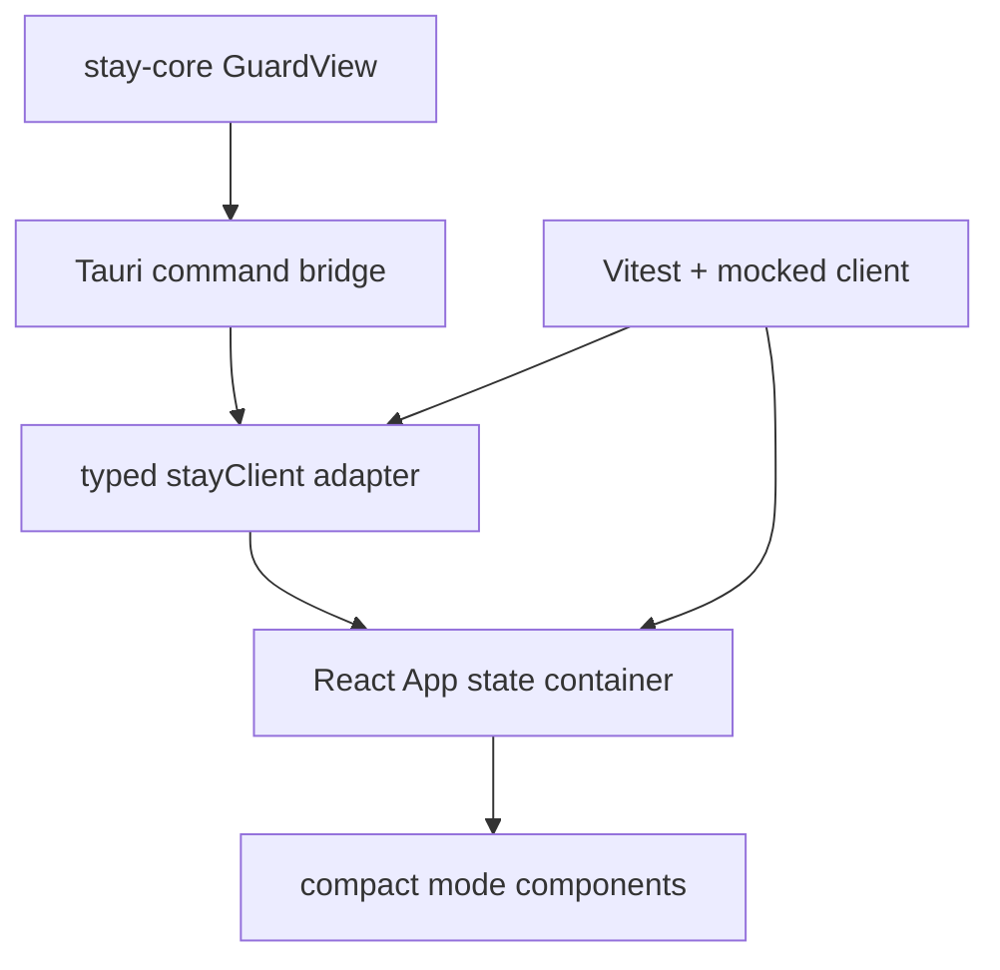

# feat: Build Modern GUI App

## Summary

Turn Stay's current static Tauri panel into a polished, modern desktop GUI app while preserving the Rust-first policy architecture. The GUI should be maintainable for humans, easy for agents to inspect and test, and faithful to Stay's quiet opt-in product posture.

---

## Problem Frame

Stay already has the core Rust state machine, platform adapter, scripted E2E harness, and an initial static desktop panel. The missing product quality is the visible app surface: the current `apps/desktop/dist` HTML/CSS/JS files are functional but thin, untyped, hard to unit test, and do not give future agents a clear component boundary. The next slice should make the GUI feel like a real desktop app without moving policy out of Rust or adding surveillance-shaped product surface.

---

## Assumptions

- The existing Tauri v2 desktop shell remains the app container because it already matches the cross-platform Rust-first architecture.
- "Modern" means a typed, componentized frontend with first-class automated tests, not a large marketing-style experience or decorative redesign.
- The first GUI should still be compact and quiet: no dashboard, analytics, account system, onboarding maze, or productivity framing.
- Frontend tests can run against mocked Tauri commands/events, while Rust command tests continue to verify the real policy bridge.

---

## Requirements

- R1. Replace the static desktop panel implementation with a maintainable typed GUI frontend.
- R2. Preserve the existing Tauri command API and Rust-owned focus guard behavior.
- R3. Provide polished UI states for idle/setup, meeting candidate, guarding, and locked modes.
- R4. Keep the design aligned with `BRAND.md`: opt-in, quiet, warm, non-punitive, and local-only.
- R5. Add agent-friendly frontend tests that exercise rendering, command calls, input constraints, and event-driven state updates without requiring native desktop interaction.
- R6. Keep desktop build and development commands documented and predictable for future agents.
- R7. Avoid introducing telemetry, manager controls, attention scores, screen capture, transcription, or remote services.

---

## Scope Boundaries

- No change to meeting detection heuristics beyond what the GUI needs to render labels safely.
- No OS-level enforcement hardening in this slice.
- No signed app packaging, auto-update pipeline, accounts, cloud sync, or app-store assets.
- No visual marketing page; the first screen is the usable app surface.

---

## Context & Research

### Relevant Code and Patterns

- `BRAND.md` defines the product tone, non-goals, and design guardrails.
- `apps/desktop/dist/index.html`, `apps/desktop/dist/styles.css`, and `apps/desktop/dist/app.js` contain the current static GUI surface.
- `apps/desktop/src-tauri/src/lib.rs` exposes the current command bridge: `current_state`, `set_pin`, `accept_stay`, `dismiss_candidate`, `stop_guarding`, `submit_pin`, and `observe_focus_for_test`.
- `apps/desktop/src-tauri/tests/commands.rs` verifies command-level behavior and should remain the Rust bridge contract.
- `crates/stay-core/src/session.rs` defines `GuardView`, which should be mirrored by frontend TypeScript types.
- `docs/development.md` currently tells future agents that `apps/desktop` renders static files from `dist`; this should be updated after the frontend toolchain changes.

### Institutional Learnings

- No `docs/solutions/` entries exist yet.

### External References

- Tauri v2 frontend configuration model: https://v2.tauri.app/
- Vite React frontend tooling: https://vite.dev/guide/
- React TypeScript guidance: https://react.dev/learn/typescript
- Vitest component testing: https://vitest.dev/

---

## Key Technical Decisions

- Keep Rust as the policy owner: frontend code renders `GuardView` and sends user intent through existing Tauri commands, but does not duplicate focus or PIN policy.
- Use Vite, React, and TypeScript for the desktop webview because they give a small modern component system, fast local builds, and straightforward unit tests without changing the Tauri container.
- Generate the production UI into `apps/desktop/dist` while moving source code into `apps/desktop/src` so built artifacts are clearly separate from maintainable source.
- Create a narrow Tauri client adapter in TypeScript so production Tauri APIs and browser/test mocks share the same interface.
- Prefer compact, state-driven components over page routing or global state libraries; Stay has one focused app surface and does not need a larger frontend framework.
- Add frontend tests alongside existing Rust tests so agents can verify UI behavior without operating the desktop session.

---

## Open Questions

### Resolved During Planning

- Should this become a GUI app or remain command/script first? Build the GUI app surface now, while keeping the deterministic script and Rust tests for verification.
- Should the GUI introduce a larger dashboard? No. Stay's product identity favors a compact opt-in control surface over a dashboard.

### Deferred to Implementation

- Exact Vite/Tauri dev-server port can follow Tauri defaults unless already in use locally.
- Exact microcopy can be adjusted during implementation as long as it stays consistent with `BRAND.md`.

---

## Output Structure

    apps/
    └── desktop/
        ├── dist/
        ├── index.html
        ├── package.json
        ├── src/
        │   ├── App.tsx
        │   ├── main.tsx
        │   ├── stayClient.ts
        │   ├── test/
        │   ├── types.ts
        │   └── ui/
        ├── src-tauri/
        ├── tsconfig.json
        └── vite.config.ts

---

## High-Level Technical Design

---

## Implementation Units

### U1. Modern Frontend Toolchain

**Goal:** Introduce a typed Vite React frontend that builds into the Tauri app while keeping `apps/desktop/dist` as generated output.

**Requirements:** R1, R2, R5, R6

**Dependencies:** None

**Files:**
- Modify: `apps/desktop/package.json`
- Create: `apps/desktop/index.html`
- Create: `apps/desktop/tsconfig.json`
- Create: `apps/desktop/tsconfig.node.json`
- Create: `apps/desktop/vite.config.ts`
- Modify: `apps/desktop/src-tauri/tauri.conf.json`
- Delete/replace generated source responsibility: `apps/desktop/dist/index.html`
- Delete/replace generated source responsibility: `apps/desktop/dist/app.js`
- Delete/replace generated source responsibility: `apps/desktop/dist/styles.css`

**Approach:**
- Add React, TypeScript, Vite, Vitest, jsdom, and Testing Library dependencies.
- Configure `npm run dev`, `npm run build`, `npm run test`, and `npm run typecheck`.
- Point Tauri development at the Vite dev server and production at the built `dist` directory.
- Keep generated `dist` files out of hand-authored architecture decisions; source of truth moves to `src`.

**Test scenarios:**
- Build check: `npm run build` produces `apps/desktop/dist`.
- Type check: `npm run typecheck` validates frontend types without emitting files.
- Regression: Tauri config still points to the frontend output expected by `tauri build`.

**Verification:**
- Frontend build, typecheck, and existing Rust desktop command tests all pass.

---

### U2. Typed Tauri Client Boundary

**Goal:** Add a small TypeScript adapter that owns Tauri invoke/listen calls and exposes a testable interface to React.

**Requirements:** R2, R5

**Dependencies:** U1

**Files:**
- Create: `apps/desktop/src/types.ts`
- Create: `apps/desktop/src/stayClient.ts`
- Create: `apps/desktop/src/test/mockStayClient.ts`
- Test: `apps/desktop/src/stayClient.test.ts`

**Approach:**
- Mirror the serialized `GuardView`, `MeetingCandidate`, `WindowSnapshot`, and command response shapes from Rust.
- Expose command methods for current state, PIN setup, accept, dismiss, stop, and submit PIN.
- Expose a state-change subscription API that hides Tauri event details from UI components.
- Provide a browser/test mock with deterministic state transitions equivalent to the existing `createBrowserMock`.

**Test scenarios:**
- Happy path: mock client moves through idle -> candidate -> guarding -> locked -> guarding.
- Edge case: state-change listeners can unsubscribe without receiving later events.
- Error path: invalid PIN setup rejects with the same user-safe message expected by UI tests.

**Verification:**
- Adapter tests run under Vitest without a Tauri runtime.

---

### U3. State-Driven GUI Components

**Goal:** Build the real app surface as accessible React components for setup, prompt, guarding, and lock states.

**Requirements:** R1, R3, R4, R5, R7

**Dependencies:** U1, U2

**Files:**
- Create: `apps/desktop/src/main.tsx`
- Create: `apps/desktop/src/App.tsx`
- Create: `apps/desktop/src/ui/PinSetup.tsx`
- Create: `apps/desktop/src/ui/MeetingPrompt.tsx`
- Create: `apps/desktop/src/ui/GuardingStatus.tsx`
- Create: `apps/desktop/src/ui/LockScreen.tsx`
- Create: `apps/desktop/src/ui/StatusShell.tsx`
- Test: `apps/desktop/src/App.test.tsx`

**Approach:**
- Treat `GuardView` as the single source of rendering truth.
- Keep the PIN setup available only when no PIN is configured.
- Render candidate, guarding, and locked modes with clear visual hierarchy and restrained copy.
- Constrain PIN inputs to four digits in the UI while relying on Rust for authoritative validation.
- Use accessible labels and live regions for state and errors.

**Test scenarios:**
- Happy path: idle with no PIN shows the setup control and no meeting prompt.
- Happy path: meeting candidate view renders meeting app/title and calls `acceptStay` when chosen.
- Happy path: locked view focuses the PIN flow and calls `submitPin` on click or Enter.
- Edge case: non-digit PIN input is stripped and length is capped at four digits.
- Error path: failed client command renders an inline error without crashing the app.
- Integration: emitted state-change event rerenders the active mode.

**Verification:**
- Component tests cover each mode and user action through a mocked client.

---

### U4. Polished Desktop Visual System

**Goal:** Replace the thin static styling with a compact, production-quality desktop panel that feels modern, calm, and specific to Stay.

**Requirements:** R3, R4

**Dependencies:** U3

**Files:**
- Create: `apps/desktop/src/styles.css`
- Modify: `apps/desktop/src/App.tsx`
- Modify: `apps/desktop/src/ui/*.tsx`

**Approach:**
- Use a restrained neutral palette with one quiet accent and clear contrast.
- Keep card radii at 8px or less and avoid dashboard-like nested cards.
- Use stable dimensions for the desktop panel, controls, and action rows to prevent layout shift across modes.
- Use subtle affordances for current state rather than punitive lock/security imagery.
- Ensure text fits the compact desktop window at minimum configured dimensions.

**Test scenarios:**
- Visual check: each app mode is reachable through the browser mock and fits inside the configured Tauri window dimensions.
- Accessibility check: controls have labels and status/error regions are announced.

**Verification:**
- Manual browser/dev-server check plus frontend tests for labels and mode visibility.

---

### U5. Agent-Ready Verification and Documentation

**Goal:** Update project verification and docs so future agents know how to work on the GUI safely.

**Requirements:** R5, R6

**Dependencies:** U1, U2, U3, U4

**Files:**
- Modify: `README.md`
- Modify: `docs/development.md`
- Modify: `apps/desktop/src-tauri/tests/commands.rs` if command coverage needs a small assertion update
- Optional create: `.github/workflows/ci.yml` if absent and current branch has no CI coverage

**Approach:**
- Document frontend commands, Rust commands, and full verification sequence.
- Explain that frontend tests mock Tauri while Rust tests verify the real command bridge.
- Add or update CI only if the repository still lacks a workflow after implementation inspection.

**Test scenarios:**
- Documentation names commands that actually pass locally.
- Full verification includes `cargo test --workspace`, `cargo run -p stay-e2e`, frontend typecheck, frontend tests, and frontend build.

**Verification:**
- Run the documented commands before committing.

---

## System-Wide Impact

- **Interaction graph:** Rust state remains authoritative; React renders snapshots and sends commands through a typed adapter.
- **Error propagation:** Tauri/Rust errors become user-safe inline UI messages without frontend policy decisions.
- **State lifecycle risks:** Event-driven rerenders must not leave stale PIN errors or stale meeting titles visible across modes.
- **API surface parity:** Frontend mocks should stay behaviorally aligned with `apps/desktop/src-tauri/tests/commands.rs` and `crates/stay-core/tests/session_policy.rs`.
- **Unchanged invariants:** Stay remains opt-in, local-only, quiet, and non-surveilling.

---

## Risks & Dependencies

| Risk | Mitigation |
|------|------------|
| Frontend toolchain adds dependency weight to a small app. | Keep the stack limited to Vite, React, TypeScript, and test tools; avoid routing, global stores, and UI frameworks. |
| Frontend types drift from Rust serialization. | Keep the TypeScript type surface narrow and covered by command/mock tests; consider generated bindings in a later slice if the API grows. |
| Tauri dev/build config breaks local desktop startup. | Verify `npm run dev` or `npm run build` plus Rust command tests after config changes. |
| UI polish accidentally makes Stay feel like a productivity dashboard. | Check copy and layout against `BRAND.md`; avoid metrics, charts, and motivational framing. |

---

## Documentation / Operational Notes

- `docs/development.md` should distinguish authored frontend files in `apps/desktop/src` from generated output in `apps/desktop/dist`.
- README should show the GUI development command and the deterministic test commands.
- Future agents should be able to run frontend tests without a desktop session and Rust E2E without human focus switching.

---

## Sources & References

- Brand source: [BRAND.md](BRAND.md)
- Existing desktop command bridge: `apps/desktop/src-tauri/src/lib.rs`
- Existing desktop command tests: `apps/desktop/src-tauri/tests/commands.rs`
- Existing core state model: `crates/stay-core/src/session.rs`
- Previous plan: `docs/plans/2026-05-11-001-feat-meeting-focus-guard-plan.md`
- Tauri v2 docs: https://v2.tauri.app/
- Vite guide: https://vite.dev/guide/
- React TypeScript docs: https://react.dev/learn/typescript
- Vitest docs: https://vitest.dev/
