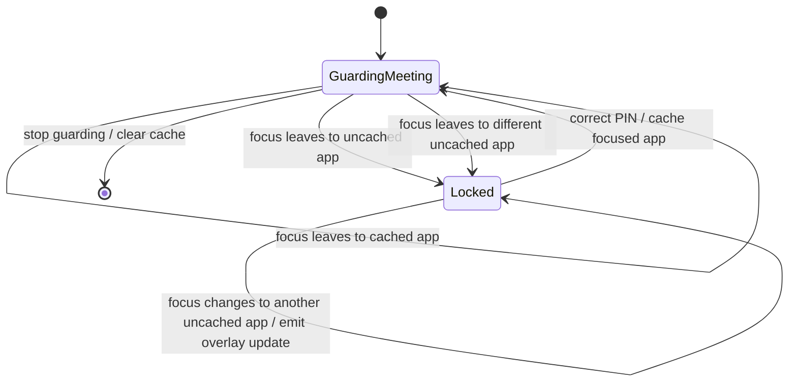

# feat: Keep Lock Overlay on Focused App and Cache Meeting App Unlocks

## Summary

Update Stay's focus guard so the lock overlay tracks the non-meeting window the user actually switches to, including subsequent switches while already locked. For each protected meeting, a successful PIN entry should authorize that focused app for the rest of the meeting session so the user is not asked for the same app again.

---

## Problem Frame

The current core loop can carry focused-window bounds into the initial lock state, and the Tauri shell can resize the Stay window to those bounds. Two gaps remain: changing focus while locked does not emit a new overlay-positioning command, and successful PIN entry always returns to a blanket guarded state instead of remembering that the user already allowed the focused app for this meeting.

---

## Assumptions

*This plan was authored without synchronous user confirmation. The items below are agent inferences that fill gaps in the input -- un-validated bets that should be reviewed before implementation proceeds.*

- "That app" means the destination application's normalized app identity, not one browser tab, process id, or individual window title.
- The authorization cache is in-memory and meeting-session scoped; it clears when guarding stops or a new protected meeting begins.
- A cached app should be allowed only while focus guard remains active for the same meeting; it is not a global preference or persisted setting.
- The lock overlay should prefer exact focused-window bounds when the platform adapter provides them and keep the existing monitor fallback when bounds are absent.

---

## Requirements

- R1. When guarded focus leaves the meeting, the Stay overlay appears over the destination window that caused the lock whenever focused-window bounds are available.
- R2. If the user changes focus again while the lock is already visible, the overlay updates to the latest non-meeting focused window.
- R3. After a successful PIN entry for a destination app, later switches from the same protected meeting to that app do not require another PIN.
- R4. The app-unlock cache is scoped to the current protected meeting and clears when the user stops guarding or starts guarding a different meeting.
- R5. Keep policy decisions in `stay-core`; Tauri and React should continue to render or position based on core state and commands.
- R6. Preserve the existing privacy posture: all cache state stays local and in-memory, with no telemetry or persistent activity history.
- R7. Cover the new behavior with deterministic Rust tests and bridge-level command assertions.

---

## Scope Boundaries

- No persistent allowlist, preferences UI, or cross-meeting app trust setting.
- No stronger OS-level blocking or accessibility automation beyond the current always-on-top window behavior.
- No change to meeting classification heuristics or supported meeting apps.
- No redesign of the lock screen copy, React component layout, or browser mock behavior unless implementation changes the serialized command contract.

---

## Context & Research

### Relevant Code and Patterns

- `crates/stay-core/src/session.rs` owns `FocusGuard`, `GuardPhase`, `GuardView`, `LockedFocus`, and `GuardCommand`; this is the right place for app-cache policy and focus-transition commands.
- `crates/stay-core/src/focus.rs` already provides `WindowSnapshot::identity_key`, normalized app/title helpers, and `WindowBounds`.
- `crates/stay-core/tests/session_policy.rs` contains deterministic tests for meeting detection, lock/unlock, dismissed candidates, and focused-window bounds in lock state.
- `apps/desktop/src-tauri/src/lib.rs` already positions the Tauri window with `position_focused_window_overlay` when it receives `GuardCommand::ShowLock { focused, .. }`.
- `apps/desktop/src-tauri/tests/commands.rs` verifies command-helper state transitions without launching the desktop window.
- `docs/development.md` states the product boundary: keep policy in `stay-core`, platform behavior behind traits, and Tauri calls behind typed boundaries.

### Institutional Learnings

- No `docs/solutions/` entries exist yet.

### External References

- External research is not needed for this slice; the relevant behavior follows existing local Tauri window-positioning and Rust state-machine patterns.

---

## Key Technical Decisions

- Use a per-meeting app authorization cache inside `FocusGuard`, not UI state, so the same rule drives Rust tests, Tauri commands, and future desktop behavior.
- Key cached app authorizations by normalized app name because the user asked for "that app" and because window ids/titles would over-prompt for browsers, notes apps, and apps with changing document titles.
- Reuse `GuardCommand::ShowLock` for overlay repositioning when the focused destination changes while locked; this keeps Tauri command handling simple because it already positions the overlay from that command.
- Store the focused destination through the locked state so a successful PIN can authorize the correct app before returning to guarding.

---

## Open Questions

### Resolved During Planning

- Should the cache persist across app launches? No. The request says "for a given meeting," so an in-memory meeting-session cache is the smaller and safer product shape.
- Should a cached app bypass Stay forever while a meeting is guarded? No. It bypasses only for the current protected meeting session.

### Deferred to Implementation

- Exact internal shape for the guarded session state can be decided while editing `GuardPhase`; the required behavior is the cache boundary and reset lifecycle.
- Whether to add a separate command variant for repositioning can be revisited if reusing `ShowLock` makes command naming confusing, but the default plan is to reuse it.

---

## High-Level Technical Design

> *This illustrates the intended approach and is directional guidance for review, not implementation specification. The implementing agent should treat it as context, not code to reproduce.*

---

## Implementation Units

### U1. Meeting-Scoped App Authorization in Core

**Goal:** Add session-scoped app unlock caching to `stay-core` so a successful PIN authorizes the focused app for the current protected meeting only.

**Requirements:** R3, R4, R5, R6, R7

**Dependencies:** None

**Files:**
- Modify: `crates/stay-core/src/session.rs`
- Modify: `crates/stay-core/src/focus.rs`
- Test: `crates/stay-core/tests/session_policy.rs`

**Approach:**
- Represent the guarded meeting as a session object or equivalent phase data that includes the protected meeting and a set of authorized destination app keys.
- Derive destination app keys from normalized `WindowSnapshot.app_name`, not title or window id.
- When a correct PIN is submitted from a locked state, add the locked focused window's app key to the current meeting's authorization cache before returning to guarding.
- In guarded state, if focus leaves the meeting for an authorized app key, keep guarding without emitting a lock command.
- Clear the cache when guarding stops, when the phase returns to idle, or when a new meeting is accepted.

**Execution note:** Add characterization tests for the current lock/unlock behavior before reshaping `GuardPhase`, then add the cache behavior tests.

**Patterns to follow:**
- Existing `dismissed_candidates` handling in `crates/stay-core/src/session.rs` for small in-memory session policy sets.
- Existing `WindowSnapshot` normalization helpers in `crates/stay-core/src/focus.rs`.

**Test scenarios:**
- Happy path: guard Zoom, switch to Safari, enter correct PIN, switch back to Zoom, then switch again to Safari -> no second `ShowLock` command.
- Happy path: guard Zoom, authorize Safari, then switch to a different app such as Slack -> Stay locks for Slack.
- Edge case: app title changes after authorization but app name remains Safari -> Stay does not ask for the PIN again.
- Edge case: stopping guarding after authorizing Safari, then starting a new meeting and switching to Safari -> Stay asks for the PIN again.
- Error path: wrong PIN while locked does not authorize the focused app, and the next focus attempt to that app still requires the PIN.
- Integration: the serialized `GuardView` remains compatible with existing frontend rendering when the internal guarded session carries cache state.

**Verification:**
- Core tests prove app authorization is scoped to one meeting and only created after successful PIN verification.

---

### U2. Overlay Reposition Commands for Locked Focus Changes

**Goal:** Ensure the core emits an overlay-positioning command whenever the locked destination changes so the Tauri shell can move the overlay to the window the user just focused.

**Requirements:** R1, R2, R5, R7

**Dependencies:** U1

**Files:**
- Modify: `crates/stay-core/src/session.rs`
- Test: `crates/stay-core/tests/session_policy.rs`
- Test: `apps/desktop/src-tauri/tests/commands.rs`

**Approach:**
- In locked state, compare the latest non-meeting focused window with the locked state's current focused destination.
- When the destination changes, update locked state and emit a lock-positioning command carrying the latest `LockedFocus`.
- Preserve the current no-op behavior when focus returns to the protected meeting while still locked, so the lock remains active until a valid PIN is entered.
- Keep zero or missing bounds as a platform fallback case rather than a core error.

**Patterns to follow:**
- Existing `ShowLock` command shape and `LockedFocus::from(&WindowSnapshot)` conversion in `crates/stay-core/src/session.rs`.
- Existing command-helper tests in `apps/desktop/src-tauri/tests/commands.rs`.

**Test scenarios:**
- Happy path: while locked on Safari, focus changes to Slack with different bounds -> core emits `ShowLock` with Slack and the new bounds.
- Edge case: while locked, observing the same app/window again -> no duplicate reposition command.
- Edge case: while locked, focus returns to the protected meeting -> no unlock and no cache mutation.
- Integration: `observe_focus_inner` returns the same reposition command that the Tauri focus loop will pass to `apply_window_commands`.

**Verification:**
- Command responses contain the latest focused-window data whenever the overlay should move.

---

## System-Wide Impact

- **Interaction graph:** `ActiveWinFocusProvider` feeds `FocusGuard`; `FocusGuard` emits commands; Tauri applies window positioning and emits state changes to React.
- **Error propagation:** PIN verification errors remain in core state as locked-mode feedback; cache misses are normal policy decisions, not user-visible errors.
- **State lifecycle risks:** The app cache must not outlive the protected meeting session or accidentally authorize a wrong destination after a focus update.
- **API surface parity:** Rust `GuardCommand` and TypeScript `GuardCommand` stay unchanged if `ShowLock` is reused; if implementation introduces a new command variant, update `apps/desktop/src/types.ts` and the mock client in the same unit.
- **Integration coverage:** Core tests prove policy; Tauri command-helper tests prove command propagation.
- **Unchanged invariants:** PIN is still voluntary friction, not strong authentication; no cache state is persisted, synced, logged, or surfaced as analytics.

---

## Risks & Dependencies

| Risk | Mitigation |
|------|------------|
| App-name cache is too broad for browsers where many unrelated tabs live under one app. | Treat this as the intended interpretation of "that app" for this slice; avoid persistence so the scope is limited to the current meeting. |
| Locked focus updates could spam reposition commands while the foreground-window adapter reports noisy metadata. | Emit reposition commands only when the destination identity changes. |
| Cache state could survive into a new meeting if stored outside the guarded session. | Keep authorization state inside the guarded meeting phase/session and test stop/new-meeting resets. |
| Platform adapters may sometimes omit bounds. | Preserve the existing monitor overlay fallback in Tauri and test the core command data when bounds are present. |

---

## Documentation / Operational Notes

- No documentation change is required if the implementation reuses the existing `ShowLock` command and preserves current developer workflows.
- No release notes, permissions updates, or user-facing help text are required for this internal behavior refinement.

---

## Sources & References

- Existing core policy: `crates/stay-core/src/session.rs`
- Existing focus data model: `crates/stay-core/src/focus.rs`
- Existing core tests: `crates/stay-core/tests/session_policy.rs`
- Existing Tauri bridge and overlay positioning: `apps/desktop/src-tauri/src/lib.rs`
- Existing desktop command tests: `apps/desktop/src-tauri/tests/commands.rs`
- Development posture: `docs/development.md`
- Prior focus-guard plan: `docs/plans/2026-05-11-001-feat-meeting-focus-guard-plan.md`
